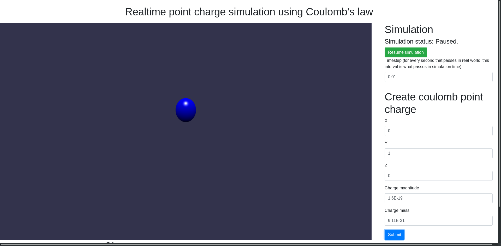

# 3D Simulation of Coulomb's law for point charges.

3D simulation of Coulomb's law through trivial constant acceleration equations and
allowing for variable time step as well as tracking of positions of charges.

# Note:

Large time step increases result in a large error.

# Technologies used:

- Bootstrap4
- jQuery3
- BabylonJS

